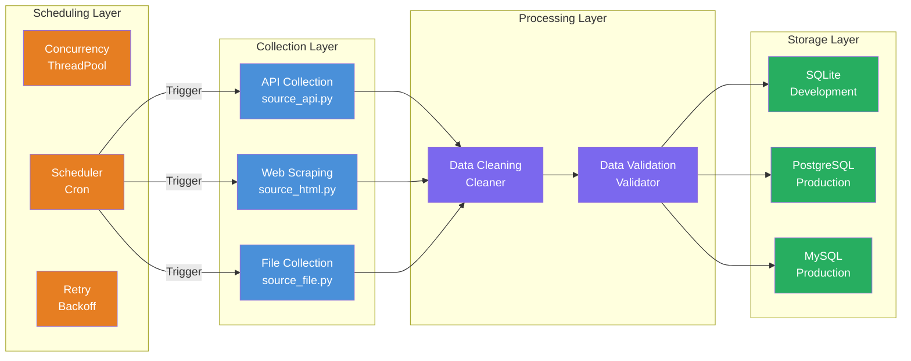

<div align="center">
<h1>Spider Awesome 🕷️</h1>
<a href="https://www.python.org"></a>
<a href="https://www.sqlalchemy.org"></a>
<a href="https://pydantic.dev"></a>
<a href="https://github.com/microsoft/playwright"></a>
<a href="https://www.chromium.org"></a>
<p>Layered-architecture data collection framework with scheduled scheduling, parallel collection, and multi-database support</p>
<a href="README.en.md">English</a> | <a href="README.md">中文</a>
</div>

<br/>

## 📋 Overview

- 🕷️ **Layered Architecture**: Collection / Processing / Storage / Scheduling — four independent layers with clear responsibilities
- 📡 **Plug and Play**: Add a new collector with a single file; auto-discovered and auto-registered
- 🗄️ **Multi-Database**: Unified interface for SQLite / PostgreSQL / MySQL; switch with one config
- ⏰ **Independent Scheduling**: Each collector has its own cron schedule; no interference
- 🔄 **Controlled Concurrency**: Thread pool parallel collection with retry and timeout protection
- 🌍 **Environment Isolation**: dev / test / prod configs; zero-code switching
- 🛡️ **Robustness**: Graceful degradation, log-level control, and auto-retry for unattended operation


<br/>


## 🏗️ Architecture




<br/>


## 🚀 Quick Start

```bash
$ make
Usage:  make [command] [options]

Available Commands:
   init           Initialize project
   format         Format code
   lint           Lint code
   bandit         Security scan
   clean          Clean project
   dev            Run in dev mode (serial)
   run            Run in production mode (parallel)
   scheduler      Run scheduler
   test           Run tests
   status         Task status
   list           Collector list
   logs           Audit logs
   help           Show help
```

**Switch Environment:**

```bash
# Linux / macOS
ENV_MODE=dev make dev
ENV_MODE=prod make scheduler

# Windows PowerShell
$env:ENV_MODE="prod"; make scheduler
```

**Example Output:**
```bash
$ make dev
🚀  DEV MODE (SERIAL) ...
==================================================
  Starting spider_awesome v1.0.0
  Env: dev | Debug: True
  Database: SQLite
  Log Level: DEBUG
==================================================

12-01 00:47:34 INF __main__:cmd_run_all:63 Running all collectors
12-01 00:47:34 INF src.scheduler.tasks:run_all_collectors:82 [Task] Running all collectors
12-01 19:47:34 INF src.scheduler.tasks:run_collector:28 [Task] Collecting: example_alerion
```
_For more details, see the [Project Documentation](docs/数据采集项目说明文档.md)_

<br/>

## 📄 License

See [MIT License](LICENSE) file.
