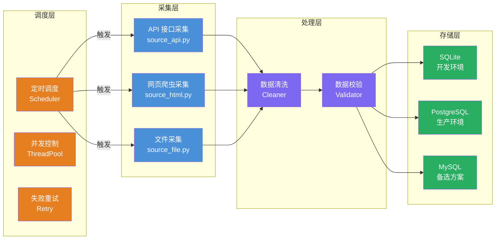

<div align="center">
<h1>Spider Awesome 🕷️</h1>
<a href="#"></a>
<a href="#"></a>
<a href="#"></a>
<a href="#"></a>
<a href="#"></a>
<p>基于分层架构的通用数据采集模板项目，支持定时调度、并行采集、多数据库切换</p>
<a href="README.md">English</a> | <a href="README.md">中文</a>
</div>

## 📋 概述

- 🕷️ **分层解耦**：采集 / 处理 / 存储 / 调度四层独立，职责清晰
- 🗄️ **多数据库支持**：默认 SQLite，可切换 PostgreSQL / MySQL
- ⏰ **定时调度**：基于 APScheduler，支持串行/并行模式
- 🔄 **并发控制**：线程池并行采集，支持失败重试
- 🌍 **环境隔离**：dev/test/prod 三套配置，通过 `ENV_MODE` 零代码切换
- 🛠️ **生产级工具链**：UV 依赖管理，Ruff 代码质量，Hatchling 构建

## 🏗️ 架构设计



## 🗂️ 项目结构

```bash
$ spider-awesome/
├── src/                       #  核心代码
│   ├── collector/             # 【采集层】数据拉取
│   │   ├── base_collector.py  #  采集器抽象基类
│   │   ├── registry.py        #  采集器注册表
│   │   └── source_*.py        #  具体采集器实现（*为站点名）
│   ├── processor/             # 【处理层】清洗、校验
│   │   ├── cleaner.py         #  数据清洗（去重/空值过滤）
│   │   └── validator.py       #  数据校验（Pydantic）
│   ├── storage/               # 【存储层】持久化
│   │   ├── base_storage.py    #  存储抽象基类
│   │   ├── mysql_store.py     #  多数据库存储（SQLite/PG/MySQL）
│   │   ├── models.py          #  ORM 模型（SQLAlchemy）
│   │   └── session.py         #  数据库会话管理
│   ├── scheduler/             # 【调度层】定时任务
│   │   ├── task_manager.py    #  任务管理器（并发控制、失败重试）
│   │   └── tasks.py           #  任务定义
│   ├── common/                #  公共层
│   │   ├── logger.py          #  日志（Loguru）
│   │   ├── http_client.py     #  HTTP 客户端
│   │   └── utils.py           #  工具函数
│   ├── env_loader.py          #  环境配置加载器
│   ├── settings.py            #  配置类
│   └── main.py                #  主入口
├── configs/                   #  环境配置
├── tests/                     #  测试
├── var/                       #  运行时数据（全部 gitignore）
│   ├── database/              #  数据库文件
│   ├── raw/                   #  采集器原始缓存
│   ├── logs/                  #  日志文件
│   ├── output/                #  测试覆盖率报告
│   ├── coverage/              #  覆盖率数据
│   ├── pytest_cache/          #  pytest 缓存
│   └── cache/                 #  其他工具缓存
├── Makefile
├── pyproject.toml
└── README.md
```

## 🚀 快速开始

- **帮助命令**

```bash
$ make help
Usage:  make [command] [options]

Available Commands:
   init           初始化环境
   clean          清理项目
   format         格式化代码
   lint           代码检查
   test           运行测试
   dev            开发运行（串行）
   run            生产运行（并行）
   scheduler      启动定时调度
   status         查看任务状态
   list           列出所有采集器
   help           查看帮助
```

- **启动采集**

```bash
$ make init
🌌  检查并初始化环境...
✅  UV 已安装: uv 0.9.26
🌍 「开发」同步依赖项...
✅  依赖安装完成

$ make dev
🚀  开发运行（串行）...
✅  [alerion] 采集完成: 125 条
✅  [asl] 采集完成: 89 条
✅  [noble] 采集完成: 234 条
📊  总计: 448 条数据
```

## ⏰ 调度配置

- **串行模式（默认）**

```bash
# 每个采集器独立调度
$ make scheduler

# 配置调度时间（configs/.env）
COLLECTOR_CRON_HOUR=0
COLLECTOR_CRON_MINUTE=0
```

- **并行模式**

```bash
# 所有采集器并行执行
$ SCHEDULER_PARALLEL=true make scheduler

# 并行配置（configs/.env）
SCHEDULER_PARALLEL=true
MAX_WORKERS=5
TASK_TIMEOUT=300
RETRY_COUNT=3
```

## 🗄️ 数据库切换

```bash
# configs/.env
DB_TYPE=sqlite          # 可选: sqlite, postgresql, mysql

# SQLite（默认）
SQLITE_PATH=var/database/spider_awesome.sqlite3

# PostgreSQL
PG_HOST=127.0.0.1
PG_PORT=5432
PG_USER=postgres
PG_PASSWORD=xxx
PG_DATABASE=spider_awesome

# MySQL
MYSQL_HOST=127.0.0.1
MYSQL_PORT=3306
MYSQL_USER=root
MYSQL_PASSWORD=xxx
MYSQL_DATABASE=spider_awesome
```

## 🕷️ 内置采集器

| 采集器 | 类型 | 文件 | 说明 |
|--------|------|------|------|
| `alerion` | POST JSON | `source_example_alerion.py` | 示例：演示 POST 请求采集 |
| `asl` | HTML 分页 | `source_example_asl.py` | 示例：演示 HTML 解析和分页采集 |
| `noble` | GET JSON | `source_example_noble.py` | 示例：演示 GET 请求采集 |

> 💡 以上为示例采集器，衍生项目可参考或删除

## ➕ 添加新采集器

1. 在 `src/collector/` 下创建 `source_新站点.py`
2. 继承 `BaseCollector` 并实现 `fetch()` 方法
3. 在 `src/collector/registry.py` 中注册

```python
from src.collector.base_collector import BaseCollector

class NewSiteCollector(BaseCollector):
    @property
    def name(self) -> str:
        return "new_site"

    def fetch(self):
        # 实现采集逻辑
        return [{"id": "1", "source": "new_site", ...}]
```

## 🌍 环境切换

通过 `ENV_MODE` 环境变量切换配置，零代码改动：

```bash
# Linux / macOS
ENV_MODE=dev make dev
ENV_MODE=prod make scheduler

# Windows PowerShell
$env:ENV_MODE="prod"; make scheduler
```

## 📄 许可证

请查看 [MIT License](LICENSE) 文件。
