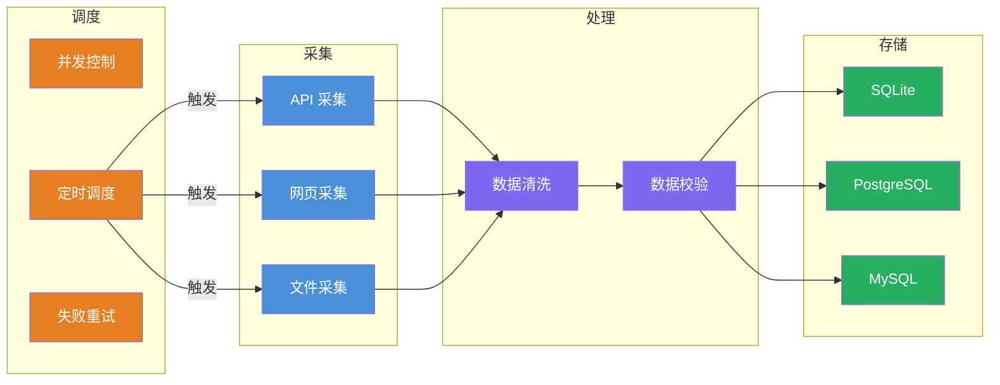

<div align="center">
<h1>Spider Awesome 🕷️</h1>
<a href="https://www.python.org"></a>
<a href="https://www.sqlalchemy.org"></a>
<a href="https://pydantic.dev"></a>
<a href="https://github.com/microsoft/playwright"></a>
<a href="https://www.chromium.org"></a>
<p>基于分层架构的通用数据采集模板项目</p>
<a href="README.en.md">English</a> | <a href="README.md">中文</a>
</div>

<br/>

## 📋 概述

- 🕷️ **分层解耦**：采集 / 处理 / 存储 / 调度四层独立，职责清晰
- 📡 **即插即用**：新增采集器只需一个文件，自动发现、自动注册
- 🗄️ **多数据库**：SQLite / PostgreSQL / MySQL 统一接口，一行配置切换
- ⏰ **独立调度**：每个采集器独立 cron 时间，互不干扰
- 🔄 **并发可控**：线程池并行采集，支持失败重试与超时保护
- 🌍 **环境隔离**：dev / test / prod 多环境配置，零代码切换
- 🛡️ **健壮性**：无人值守场景下的错误降级、日志分级、自动重试
- 🎭 **反爬防护**：代理池轮换、User-Agent 轮换、请求间隔控制
- 🌐 **JS 渲染**：基于 Playwright 的动态页面采集，内置反检测

<br/>

## 🏗️ 架构设计



<br/>

## 🚀 快速开始

```bash
$ make
Usage:  make [command] [options]

Available Commands:
   init           初始化
   lint           代码检查
   bandit         安全扫描
   format         格式化代码
   clean          清理项目
   run            开发运行（串行）
   prod           生产运行（并行）
   scheduler      生产运行（定时）
   test           运行测试
   status         任务状态
   list           采集列表
   logs           审计日志
   help           查看帮助
```

**切换环境：**

```bash
# Linux / macOS
ENV_MODE=dev make dev
ENV_MODE=prod make scheduler

# Windows PowerShell
$env:ENV_MODE="prod"; make scheduler
```

**执行示例：**

```bash
$ make dev
🚀  开 发 运 行 （ 串 行 ） ...
==================================================
  启 动  spider_awesome v1.0.0
  环 境 : dev | 调 试 : True
  数 据 库 : SQLite
  日 志 级 别 : DEBUG
==================================================

12-01 00:47:34 INF __main__:cmd_run_all:63 开 始 执 行 所 有 采 集 任 务
12-01 00:47:34 INF app.scheduler.tasks:run_all_collectors:82 [Task] 开 始 执 行 所 有 采 集 任 务
12-01 19:47:34 INF app.scheduler.tasks:run_collector:28 [Task] 开 始 采 集 : example_alerion
```

_更多内容，请查看[数据采集项目说明文档](docs/数据采集项目说明文档.md)_

<br/>

## 📄 许可证

请查看 [MIT License](LICENSE) 文件。
