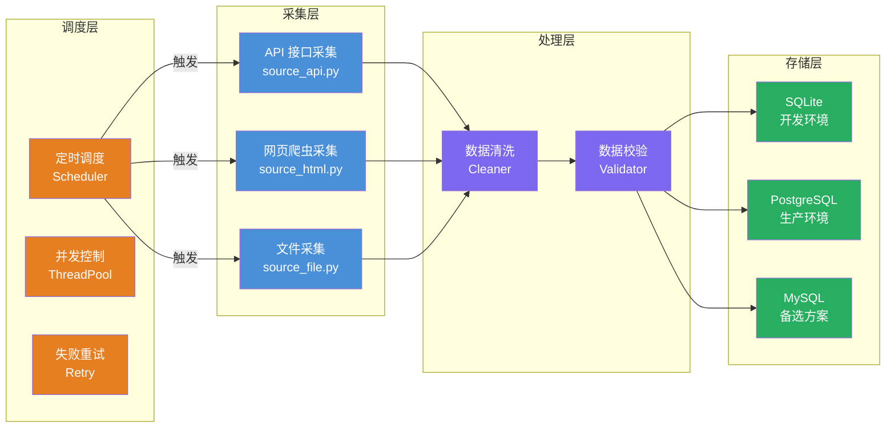

<div align="center">
<h1>Spider Awesome 🕷️</h1>
<a href="#"></a>
<a href="#"></a>
<a href="#"></a>
<a href="#"></a>
<a href="#"></a>
<p>基于分层架构的通用数据采集模板项目，支持定时调度、并行采集、多数据库切换</p>
<a href="README.md">English</a> | <a href="README.md">中文</a>
</div>

<br/>

## 📋 概述

- 🕷️ **分层解耦**：采集 / 处理 / 存储 / 调度四层独立，职责清晰
- 🗄️ **多数据库支持**：统一 `DATABASE_URL` 连接串，支持 SQLite / PostgreSQL / MySQL
- ⏰ **定时调度**：基于 APScheduler，支持串行/并行模式，每个采集器独立调度
- 🔄 **并发控制**：线程池并行采集，支持失败重试
- 📡 **采集器自动发现**：`source_*.py` 自动注册，YAML 配置启停
- 🌍 **环境隔离**：dev/test/prod 三套配置，通过 `ENV_MODE` 零代码切换
- 🛠️ **生产级工具链**：UV 依赖管理，Ruff 代码质量，Hatchling 构建


<br/>


## 🏗️ 架构设计




<br/>


## 🚀 快速开始

```bash
$ make
Usage:  make [command] [options]

Available Commands:
   init           初始化
   format         格式化
   lint           代码检查
   bandit         安全扫描
   clean          清理项目
   dev            开发运行（串行）
   run            生产运行（并行）
   scheduler      生产运行（定时）
   test           运行测试
   status         任务状态
   list           采集列表
   logs           审计日志
   help           查看帮助
```

**切换环境：**

```bash
# Linux / macOS
ENV_MODE=dev make dev
ENV_MODE=prod make scheduler

# Windows PowerShell
$env:ENV_MODE="prod"; make scheduler
```
**执行示例：**
```bash
$ make dev
🚀  开 发 运 行 （ 串 行 ） ...
==================================================
  启 动  spider_awesome v1.0.0
  环 境 : dev | 调 试 : True
  数 据 库 : SQLite
  日 志 级 别 : DEBUG
==================================================

12-01 00:47:34 INF __main__:cmd_run_all:63 开 始 执 行 所 有 采 集 任 务
12-01 00:47:34 INF src.scheduler.tasks:run_all_collectors:82 [Task] 开 始 执 行 所 有 采 集 任 务
12-01 19:47:34 INF src.scheduler.tasks:run_collector:28 [Task] 开 始 采 集 : example_alerion
```
_更多内容，请查看[数据采集项目说明文档](docs/数据采集项目说明文档.md)_

<br/>

## 📄 许可证

请查看 [MIT License](LICENSE) 文件。
