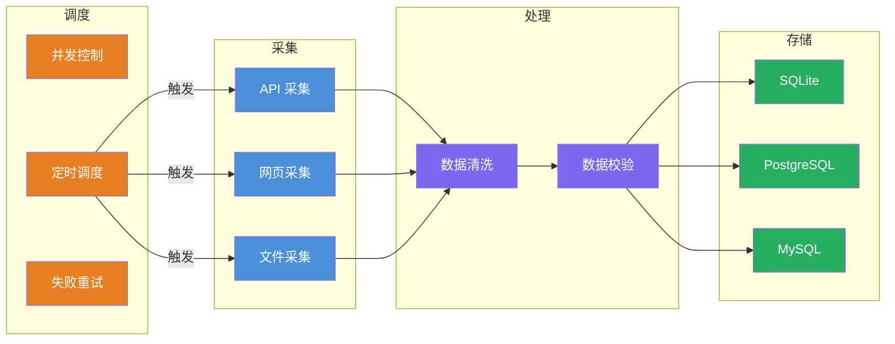
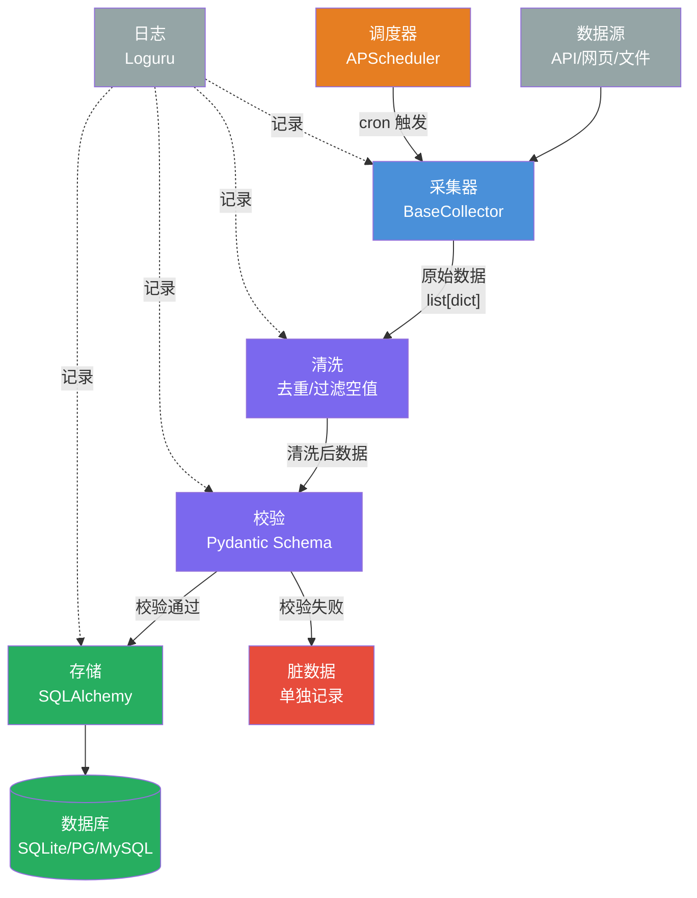
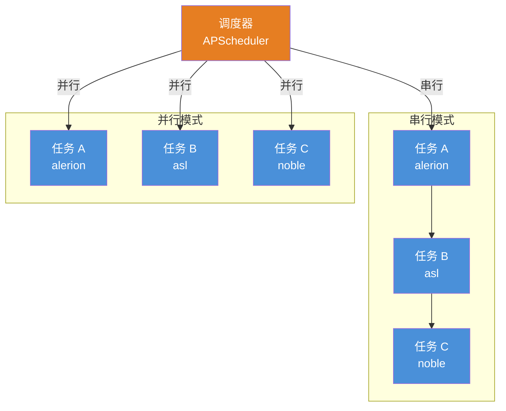
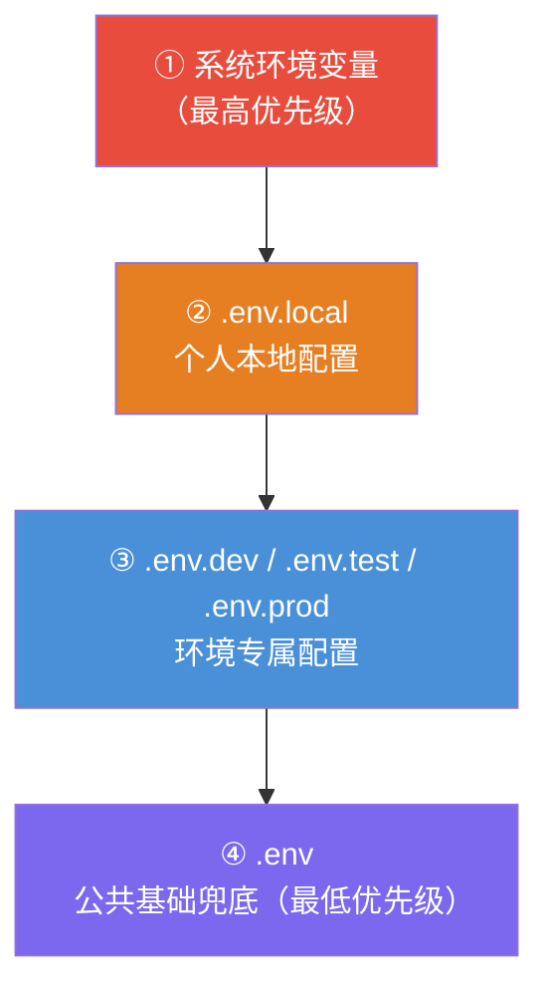
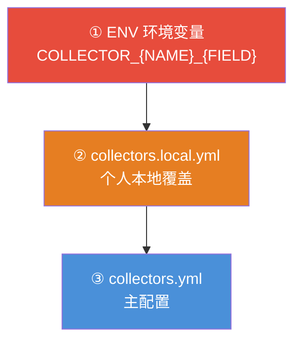

# 数据采集最佳设计方案

> 📌 **通用规范**，与项目无直接关联，勿随意改动项目结构。

[TOC]

## 一、📄 概述

适配「采集 → 清洗处理 → 存储 → 调度」全链路，支持单机运行、多机部署、定时任务、日志完整、配置解耦、可打包上线，适配爬虫 / 传感器 / 接口拉取各类数据源。

整体遵循**分层解耦、单一职责、配置与代码分离、环境隔离**，兼容 Windows / macOS / Linux。

<br/>

## 二、📁 工程目录结构

```bash
spider_awesome/
├── configs/                       #  环境配置
│   ├── .env                       #  全量脱敏基础配置
│   ├── .env.dev                   #  开发环境专属
│   ├── .env.test                  #  测试环境专属
│   ├── .env.prod                  #  生产环境模板（仅占位符）
│   ├── .env.local                 #  个人本地覆盖（禁止提交）
│   ├── collectors.yml             #  采集器主配置
│   ├── collectors.example.yml     #  采集器配置完整示例
│   └── collectors.local.yml       #  采集器本地覆盖（禁止提交）
├── src/                           #  核心业务代码
│   ├── collector/                 # 【采集层】数据拉取
│   │   ├── base_collector.py      #  采集器抽象基类
│   │   ├── registry.py            #  采集器注册表（自动发现）
│   │   └── source_*.py            #  具体采集器实现
│   ├── processor/                 # 【处理层】清洗、校验
│   │   ├── cleaner.py             #  数据清洗（去重/空值过滤）
│   │   └── validator.py           #  数据校验（Pydantic）
│   ├── storage/                   # 【存储层】持久化
│   │   └── mysql_store.py         #  多数据库存储（SQLite/PG/MySQL）
│   ├── scheduler/                 # 【调度层】定时任务
│   │   ├── task_manager.py        #  任务管理器（并发控制、失败重试）
│   │   └── tasks.py               #  任务定义
│   ├── common/                    #  公共层
│   │   ├── logger.py              #  日志（Loguru，按天轮转）
│   │   ├── http_client.py         #  HTTP 客户端
│   │   └── utils.py               #  工具函数
│   ├── env_loader.py              #  环境配置加载器
│   ├── settings.py                #  配置类
│   └── main.py                    #  主入口
├── tests/                         #  测试
├── var/                           #  运行时数据（全部 gitignore）
│   ├── database/                  #  数据库文件
│   ├── raw/                       #  采集器原始缓存
│   ├── logs/                      #  日志文件
│   └── output/                    #  测试覆盖率报告
├── Makefile                       #  快捷命令
├── pyproject.toml                 #  项目配置
└── README.md
```

<br/>

## 三、🏗️ 分层架构设计

### 3.1 架构总览



### 3.2 数据流图



### 3.3 采集层 `src/collector`

设计抽象基类强制统一方法，新增数据源不用改上层代码，遵循开闭原则。

```python
# base_collector.py
class BaseCollector:
    @property
    def name(self) -> str:
        """采集器名称"""
        raise NotImplementedError

    def fetch(self) -> list[dict]:
        """拉取原始数据"""
        raise NotImplementedError
```

- 多数据源拆分：接口、爬虫、文件完全隔离
- 公共 HTTP 客户端抽离到 `common/http_client`，统一配置重试、代理、超时
- 采集失败自动告警（日志 + 可对接钉钉 / 企业微信）

### 3.4 处理层 `src/processor`

必须拆分清洗与校验能力，禁止处理逻辑散落在采集代码里。

| 模块 | 职责 |
|------|------|
| `cleaner` | 删除空行、重复数据、乱码、非法值；支持按唯一键去重 |
| `validator` | 用 Pydantic 强校验字段类型，不合格数据单独记录，不阻塞全量任务 |

### 3.5 存储层 `src/storage`

统一抽象写入接口，随时切换 SQLite / PostgreSQL / MySQL，上层业务无感知。

支持：批量插入、分表写入、写入失败重试。

```bash
src/storage/
├── base_storage.py    # 存储抽象基类
├── mysql_store.py     # 多数据库存储实现
├── models.py          # ORM 模型（SQLAlchemy）
└── session.py         # 数据库会话管理
```

### 3.6 调度层 `src/scheduler`

基于 APScheduler 实现分钟 / 小时 / 日定时采集。



- 多任务不同 Cron 周期
- 任务并发控制，防止重复跑
- 支持失败自动重试（可配置次数和间隔）

### 3.7 公共层 `src/common`

全项目复用。

| 模块 | 职责 |
|------|------|
| `logger` | 全局唯一日志，按日期分割，控制台 + 文件双输出 |
| `http_client` | 统一 requests 封装（重试、代理、超时） |
| `utils` | 通用工具：时间戳转换、路径获取、文件读写 |

### 3.8 配置体系

#### 3.8.1 环境配置



| 配置层 | 内容 | Git 提交 |
|------|------|---------|
| `.env` | 全量脱敏基础配置，敏感项占位 | ✅ 提交 |
| `.env.{mode}` | 环境专属配置（dev/test/prod） | ✅ 提交 |
| `.env.local` | 个人本地覆盖，敏感信息真实值 | ❌ 禁止提交 |
| `settings.py` | 统一读取所有配置，全项目只导入 settings | ✅ 提交 |

#### 3.8.2 采集器配置



| 配置层 | 内容 | Git 提交 |
|------|------|---------|
| `collectors.yml` | 采集器主配置（启停、调度、参数） | ✅ 提交 |
| `collectors.example.yml` | 完整示例和参考文档 | ✅ 提交 |
| `collectors.local.yml` | 个人本地覆盖 | ❌ 禁止提交 |
| ENV 变量 | 临时覆盖（CI/CD、调试） | N/A |

<br/>

## 四、🚀 运行方式

### 4.1 初始化环境

```bash
make init
# 或手动执行
uv sync
```

### 4.2 单次手动采集

```bash
# 开发运行（串行）
make dev

# 生产运行（并行）
make run

# 启动定时调度
make scheduler
```

也可以直接使用 Python CLI：

```bash
# 执行单个采集器
uv run python src/main.py run --source=alerion

# 执行所有采集器（串行）
uv run python src/main.py run-all

# 并行执行采集器
uv run python src/main.py run-parallel
```

### 4.3 启动定时调度

```bash
# 串行模式
uv run python src/main.py scheduler

# 并行模式（配置 SCHEDULER_PARALLEL=true）
SCHEDULER_PARALLEL=true uv run python src/main.py scheduler
```

<br/>

## 五、📋 规范约束

1. **绝对禁止硬编码**：URL、账号、端口、超时时间全部进配置
2. **原始数据与处理数据物理隔离**：`var/` 目录统一存放所有运行时数据，各子目录职责明确
3. **所有入出参用 Pydantic 约束**：采集入参、处理字段全部结构化
4. **日志分级**：INFO 正常流程、WARNING 脏数据、ERROR 采集失败
5. **单条失败不阻断整批**：所有 IO 操作加异常捕获，单条数据失败不打断整批任务
6. **多环境隔离**：通过 `ENV_MODE` 切换 dev/test/prod 配置

<br/>

## 六、🔌 扩展适配方案

| 方向 | 方案 |
|------|------|
| 新增采集器 | 继承 `BaseCollector`，实现 `fetch()` 方法，**自动发现，无需注册** |
| 大数据 | 处理层对接 Pandas / Polars，新增批量大文件处理 |
| 容器化 | Docker 打包，一键部署服务器 |
| 监控 | 接入 Prometheus 埋点，统计采集条数、失败率、接口响应耗时 |

### 6.1 新增采集器详细步骤

**Step 1: 创建采集器文件**

```python
# src/collector/source_mymusic.py
from src.collector.base_collector import BaseCollector
from src.common.logger import logger


class MyMusicCollector(BaseCollector):
    """音乐数据采集器"""

    @property
    def name(self) -> str:
        return "mymusic"

    def fetch(self) -> list[dict]:
        # 实现采集逻辑
        records = []
        # ...
        logger.info(f"[{self.name}] 采集完成，共 {len(records)} 条")
        return records
```

**Step 2: 添加配置（可选）**

```yaml
# configs/collectors.yml
collectors:
  mymusic:
    enabled: true
    cron: "0 */6 * * *"        # 每 6 小时
    timeout: 600
    config:
      api_key: "xxx"           # 采集器特定配置
```

**Step 3: 完成！**

```bash
python src/main.py list                    # 看到 mymusic
python src/main.py run --source=mymusic    # 执行采集
```

**自动发现机制：**
- 文件命名：`source_{name}.py`
- 类命名：`{Name}Collector`（继承 `BaseCollector`）
- 无需修改 `registry.py`，创建文件即自动注册

<br/>

## 七、📌 要点总结

1. **分层解耦**：采集 / 处理 / 存储 / 调度四层独立，单一职责
2. **抽象基类**：各层统一抽象接口，新增数据源 / 存储介质不改上层代码
3. **配置分离**：`.env` 系列存环境配置，`collectors.yml` 存采集器配置，`settings.py` 统一读取
4. **自动发现**：采集器 `source_*.py` 自动注册，创建文件即可使用
5. **调度兜底**：APScheduler 常驻 + 并行支持，每个采集器独立调度
6. **单条容错**：异常捕获粒度到单条数据，失败不阻断整批任务
7. **环境隔离**：dev/test/prod 三套配置，零代码切换
