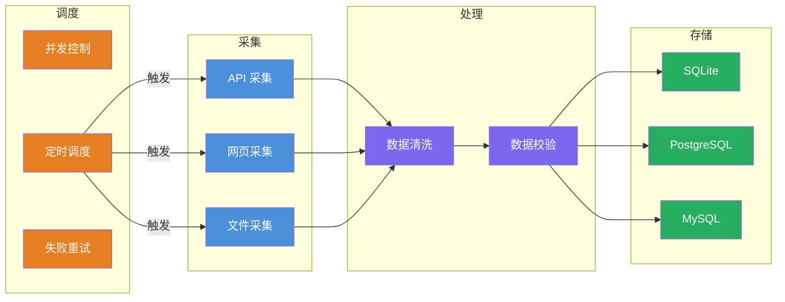
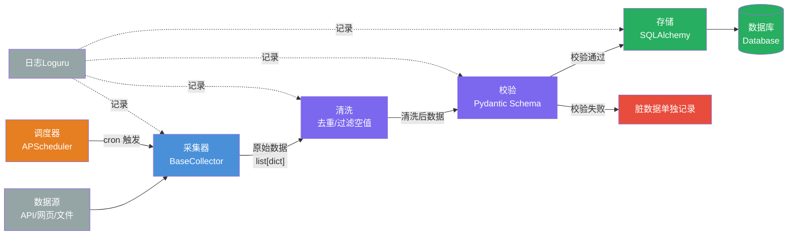
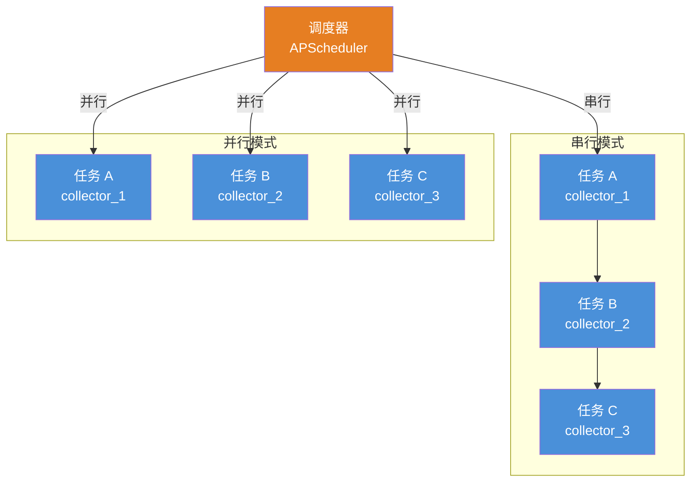
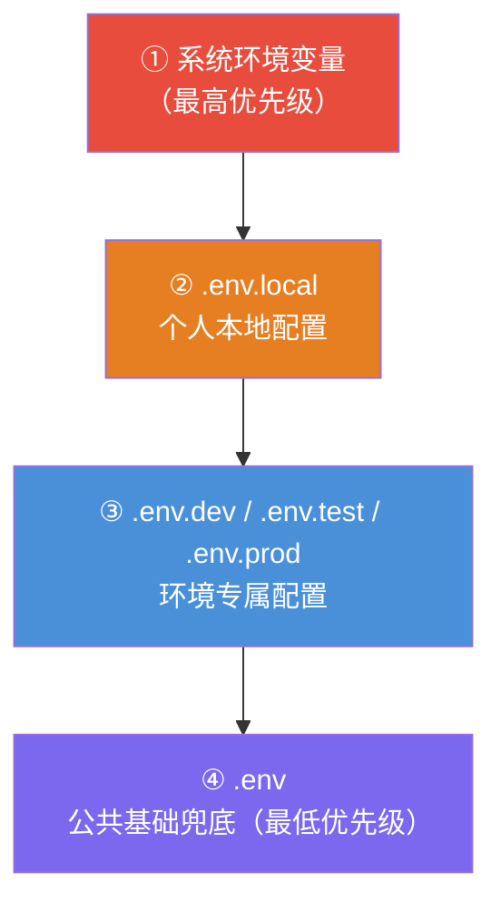
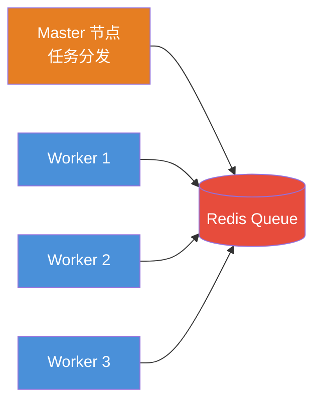

# 数据采集最佳设计方案

> 📌 **通用规范**，与项目无直接关联，勿随意改动项目结构。

[TOC]

## 一、📄 概述

适配「采集 → 清洗处理 → 存储 → 调度」全链路，支持单机运行、多机部署、定时任务、日志完整、配置解耦、可打包上线，适配爬虫 / 传感器 / 接口拉取各类数据源。

整体遵循**分层解耦、单一职责、配置与代码分离、环境隔离**，兼容 Windows / macOS / Linux。

<br/>

## 二、📁 工程目录结构

```bash
spider_awesome/
├── configs/                       #  环境配置
│   ├── .env                       #  全量脱敏基础配置
│   ├── .env.dev                   #  开发环境专属
│   ├── .env.test                  #  测试环境专属
│   ├── .env.prod                  #  生产环境模板（仅占位符）
│   └── .env.local                 #  个人本地覆盖（禁止提交）
├── app/                           #  核心业务代码
│   ├── collector/                 # 【采集层】数据拉取
│   │   ├── base_collector.py      #  采集器抽象基类
│   │   ├── registry.py            #  采集器注册表（自动发现）
│   │   ├── source_define.py       #  数据源定义（注册 SourceMeta）
│   │   └── source_resolve_*.py    #  具体采集器实现
│   ├── processor/                 # 【处理层】清洗、校验
│   │   ├── cleaner.py             #  数据清洗（去重/空值过滤）
│   │   └── validator.py           #  数据校验（Pydantic）
│   ├── storage/                   # 【存储层】持久化
│   │   ├── base_storage.py        #  存储抽象基类
│   │   └── store.py               #  多数据库存储实现
│   ├── scheduler/                 # 【调度层】定时任务
│   │   ├── task_manager.py        #  任务管理器（并发控制、失败重试）
│   │   └── tasks.py               #  任务定义
│   ├── common/                    #  公共层
│   │   ├── logger.py              #  日志（Loguru，按天轮转）
│   │   ├── http_client.py         #  HTTP 客户端
│   │   └── utils.py               #  工具函数
│   ├── env_loader.py              #  环境配置加载器
│   ├── settings.py                #  配置类
│   └── main.py                    #  主入口
├── tests/                         #  测试
├── var/                           #  运行时数据（全部 gitignore）
│   ├── database/                  #  数据库文件
│   ├── raw/                       #  采集器原始缓存
│   ├── logs/                      #  日志文件
│   └── output/                    #  测试覆盖率报告
├── Makefile                       #  快捷命令
├── pyproject.toml                 #  项目配置
└── README.md
```

<br/>

## 三、🏗️ 分层架构设计

### 3.1 架构总览



### 3.2 数据流图



### 3.3 采集层 `app/collector`

设计抽象基类强制统一方法，新增数据源不用改上层代码，遵循开闭原则。

```python
# base_collector.py
class BaseCollector:
    @property
    def name(self) -> str:
        """采集器名称"""
        raise NotImplementedError

    def fetch(self) -> list[dict]:
        """拉取原始数据"""
        raise NotImplementedError
```

- 多数据源拆分：接口、爬虫、文件完全隔离
- 公共 HTTP 客户端抽离到 `common/http_client`，统一配置重试、代理、超时
- 采集失败自动告警（日志 + 可对接钉钉 / 企业微信）

### 3.4 处理层 `app/processor`

必须拆分清洗与校验能力，禁止处理逻辑散落在采集代码里。

| 模块        | 职责                                                           |
| ----------- | -------------------------------------------------------------- |
| `cleaner`   | 删除空行、重复数据、乱码、非法值；支持按唯一键去重             |
| `validator` | 用 Pydantic 强校验字段类型，不合格数据单独记录，不阻塞全量任务 |

### 3.5 存储层 `app/storage`

统一抽象写入接口，随时切换 SQLite / PostgreSQL / MySQL，上层业务无感知。

支持：批量插入、分表写入、写入失败重试。

```bash
app/storage/
├── base_storage.py    # 存储抽象基类
├── store.py           # 多数据库存储实现
├── models.py          # ORM 模型（SQLAlchemy）
└── session.py         # 数据库会话管理
```

### 3.6 调度层 `app/scheduler`

基于 APScheduler 实现分钟 / 小时 / 日定时采集。



- 多任务不同 Cron 周期
- 任务并发控制，防止重复跑
- 支持失败自动重试（可配置次数和间隔）

### 3.7 公共层 `app/common`

全项目复用。

| 模块          | 职责                                          |
| ------------- | --------------------------------------------- |
| `logger`      | 全局唯一日志，按日期分割，控制台 + 文件双输出 |
| `http_client` | 统一 requests 封装（重试、代理、超时）        |
| `utils`       | 通用工具：时间戳转换、路径获取、文件读写      |

### 3.8 配置体系

#### 3.8.1 环境配置



| 配置层        | 内容                                    | Git 提交    |
| ------------- | --------------------------------------- | ----------- |
| `.env`        | 全量脱敏基础配置，敏感项占位            | ✅ 提交     |
| `.env.{mode}` | 环境专属配置（dev/test/prod）           | ✅ 提交     |
| `.env.local`  | 个人本地覆盖，敏感信息真实值            | ❌ 禁止提交 |
| `settings.py` | 统一读取所有配置，全项目只导入 settings | ✅ 提交     |

#### 3.8.2 采集器配置

**代码即配置**：采集器的元数据（名称、启用状态、cron 调度、超时时间等）统一在 `app/collector/source_define.py` 中通过 `SourceMeta` 数据类注册。

```python
# app/collector/source_define.py
from app.collector.source_define import SourceMeta, SourceType

SOURCES = {
    # ... 已有采集器
    "collector_name": SourceMeta(
        name="collector_name",
        display_name="采集器显示名称",
        source_type=SourceType.API_JSON,  # 或 SOURCE_TYPE_WEB_HTML 等
        description="采集器描述",
        url="https://api.example.com/data",
        operator_id="operator_id_here",
        enabled=True,
        cron="0 */2 * * *",
        timeout=300,
        retry=3,
        persist=True,
    ),
}
```
| 配置层       | 内容                                   | Git 提交    |
| ------------ | -------------------------------------- | ----------- |
| `source_define.py` | 采集器源定义（启停、调度、参数）  | ✅ 提交     |
| ENV 变量     | 临时覆盖（CI/CD、调试）                | N/A         |

<br/>

## 四、🚀 运行方式

### 4.1 初始化环境

```bash
make init
# 或手动执行
uv sync
```

### 4.2 单次手动采集

```bash
# 开发运行（串行）
make run

# 生产运行（并行）
make prod

# 启动定时调度
make scheduler
```

也可以直接使用 Python CLI：

```bash
# 执行单个采集器
uv run python app/main.py run --source=collector_name

# 执行所有采集器（串行）
uv run python app/main.py run-all

# 并行执行采集器
uv run python app/main.py run-parallel
```

### 4.3 启动定时调度

```bash
# 串行模式
uv run python app/main.py scheduler

# 并行模式（配置 SCHEDULER_PARALLEL=true）
SCHEDULER_PARALLEL=true uv run python app/main.py scheduler
```

<br/>

## 五、📋 规范约束

1. **绝对禁止硬编码**：URL、账号、端口、超时时间全部进配置
2. **原始数据与处理数据物理隔离**：`var/` 目录统一存放所有运行时数据，各子目录职责明确
3. **所有入出参用 Pydantic 约束**：采集入参、处理字段全部结构化
4. **日志分级**：INFO 正常流程、WARNING 脏数据、ERROR 采集失败
5. **单条失败不阻断整批**：所有 IO 操作加异常捕获，单条数据失败不打断整批任务
6. **多环境隔离**：通过 `ENV_MODE` 切换 dev/test/prod 配置

<br/>

## 六、🔌 扩展适配方案

| 方向       | 方案                                                              |
| ---------- | ----------------------------------------------------------------- |
| 新增采集器 | 继承 `BaseCollector`，在 `source_define.py` 注册 `SourceMeta`，自动发现 |
| 大数据     | 处理层对接 Pandas / Polars，新增批量大文件处理                    |
| 容器化     | Docker 打包，一键部署服务器                                       |
| 监控       | 接入 Prometheus 埋点，统计采集条数、失败率、接口响应耗时          |

### 6.1 新增采集器详细步骤

**Step 1: 注册 SourceMeta**

```python
# app/collector/source_define.py
from app.collector.source_define import SourceMeta, SourceType

SOURCES = {
    # ... 已有采集器
    "new_collector": SourceMeta(
        name="new_collector",
        display_name="新采集器显示名称",
        source_type=SourceType.API_JSON,
        description="新采集器描述",
        url="https://api.example.com/new_data",
        operator_id="operator_id_here",
        cron="0 */6 * * *",
        timeout=600,
    ),
}
```

**Step 2: 创建 resolve 文件**

```python
# app/collector/source_resolve_new_collector.py
from app.collector.base_collector import BaseCollector
from app.common.logger import logger


class NewCollectorResolver(BaseCollector):
    """新采集器"""

    @property
    def name(self) -> str:
        return "new_collector"

    def fetch(self) -> list[dict]:
        # 实现采集逻辑
        records = []
        # ...
        logger.info(f"[{self.name}] 采集完成，共 {len(records)} 条")
        return records
```

**完成！**

```bash
python app/main.py list                    		 # 看到 new_collector
python app/main.py run --source=new_collector    # 执行采集
```

**自动发现机制：**

- 文件命名：`source_resolve_{name}.py`
- 类命名：`{Name}Resolver`（继承 `BaseCollector`）
- 无需修改 `registry.py`，创建文件即自动注册

<br/>

## 七、📌 要点总结

1. **分层解耦**：采集 / 处理 / 存储 / 调度四层独立，单一职责
2. **抽象基类**：各层统一抽象接口，新增数据源 / 存储介质不改上层代码
3. **配置分离**：`.env` 系列存环境配置，`source_define.py` 存采集器源定义，`settings.py` 统一读取
4. **自动发现**：采集器 `source_resolve_*.py` 自动注册，创建文件即可使用
5. **调度兜底**：APScheduler 常驻 + 并行支持，每个采集器独立调度
6. **单条容错**：异常捕获粒度到单条数据，失败不阻断整批任务
7. **环境隔离**：dev/test/prod 三套配置，零代码切换

---

## 八、🚀 扩展功能方案（Future Work）

> 以下功能作为后续扩展储备，当前项目暂未实现，按需开发。

### 8.1 分布式爬虫

**适用场景**：单机采集效率不足，需要多节点协作。

#### 方案一：Redis 队列 + Worker 模式



**核心组件**：
- `TaskQueue`：基于 Redis List / Stream 的任务队列
- `Worker`：独立进程，消费任务并执行采集
- `TaskDistributor`：Master 节点，负责任务拆分和分发

**数据结构**：
```python
# Redis 中的任务结构
{
    "task_id": "uuid",
    "collector": "collector_name",
    "params": {...},  # 采集参数（如分页页码）
    "status": "pending",  # pending / processing / done / failed
    "retry_count": 0,
    "created_at": "2024-01-01T00:00:00",
}
```

**新增配置**：
```yaml
# configs/.env
REDIS_URL=redis://localhost:6379/0
DISTRIBUTED_MODE=false
WORKER_CONCURRENCY=5
```

#### 方案二：Celery 分布式任务

```python
# app/distributed/tasks.py
from celery import Celery

app = Celery("spider", broker="redis://localhost:6379/0")


@app.task(bind=True, max_retries=3)
def run_collector_task(self, collector_name: str):
    try:
        collector = get_collector(collector_name)
        records = collector.fetch()
        # 处理和存储...
    except Exception as exc:
        self.retry(exc=exc, countdown=60)
```

---

### 8.2 代理 API 集成

**适用场景**：需要大量动态代理 IP，手动维护代理池不现实。

#### 支持的代理服务商

| 服务商 | API 示例 | 协议支持 |
|--------|----------|----------|
| 快代理 | `http://dps.kuaidaili.com/api/...` | HTTP/HTTPS/SOCKS5 |
| 蘑菇代理 | `http://product.jiangxianli.com/api/...` | HTTP/HTTPS |
| 芝麻代理 | `http://zhimahttp.zhimavip.com/...` | HTTP/HTTPS |
| 讯代理 | `http://http.0daydns.com/...` | HTTP/HTTPS |

#### 实现方案

```python
# app/common/proxy_api.py
class ProxyAPIClient:
    """代理 API 客户端"""

    def __init__(self, provider: str, api_url: str, api_key: str):
        self.provider = provider
        self.api_url = api_url
        self.api_key = api_key

    def fetch_proxies(self, count: int = 10) -> list[str]:
        """从 API 获取代理列表"""
        params = {"api_key": self.api_key, "num": count, "type": "json"}
        resp = requests.get(self.api_url, params=params)
        data = resp.json()
        return [item["ip:port"] for item in data.get("data", [])]

    def report_failed(self, proxy: str) -> None:
        """报告代理失效（部分服务商支持）"""
        pass


# app/common/proxy_pool.py 中集成
class ProxyPool:
    def __init__(self, ..., api_client: ProxyAPIClient | None = None):
        self._api_client = api_client

    def _auto_refresh(self):
        """自动刷新代理池"""
        if self._api_client and self.valid_count < self._min_valid:
            new_proxies = self._api_client.fetch_proxies(count=10)
            for p in new_proxies:
                self.add_proxy(p)
```

**新增配置**：
```yaml
# configs/.env
PROXY_API_ENABLED=false
PROXY_API_PROVIDER=kuaidaili
PROXY_API_URL=http://dps.kuaidaili.com/api/getSingle
PROXY_API_KEY=your_api_key
PROXY_API_MIN_VALID=5   # 低于此数量自动刷新
```

---

### 8.3 Cookie / Session 管理

**适用场景**：需要登录态的网站采集，或需要保持会话状态。

#### 实现方案

```python
# app/common/cookie_jar.py
import json
from pathlib import Path
from http.cookiejar import MozillaCookieJar


class CookieManager:
    """Cookie 管理器"""

    def __init__(self, cookie_dir: str = "var/cookies"):
        self.cookie_dir = Path(cookie_dir)
        self.cookie_dir.mkdir(parents=True, exist_ok=True)

    def save_cookies(self, collector_name: str, cookies: list[dict]):
        """保存 Cookie 到文件"""
        cookie_file = self.cookie_dir / f"{collector_name}.json"
        with open(cookie_file, "w") as f:
            json.dump(cookies, f)

    def load_cookies(self, collector_name: str) -> list[dict]:
        """加载 Cookie"""
        cookie_file = self.cookie_dir / f"{collector_name}.json"
        if cookie_file.exists():
            with open(cookie_file) as f:
                return json.load(f)
        return []

    def is_expired(self, collector_name: str) -> bool:
        """检查 Cookie 是否过期"""
        cookies = self.load_cookies(collector_name)
        if not cookies:
            return True
        # 检查 expires 字段
        import time

        for cookie in cookies:
            if cookie.get("expires", 0) < time.time():
                return True
        return False


# 在采集器中使用
class LoginCollector(BaseCollector):
    def __init__(self):
        super().__init__()
        self.cookie_manager = CookieManager()

    def fetch(self):
        # 加载 Cookie
        cookies = self.cookie_manager.load_cookies(self.name)

        # 检查是否需要登录
        if not cookies or self.cookie_manager.is_expired(self.name):
            cookies = self._login()
            self.cookie_manager.save_cookies(self.name, cookies)

        # 使用 Cookie 请求
        response = self.http_client.get(url, cookies=cookies)
        return self._parse(response.json())

    def _login(self) -> list[dict]:
        """执行登录，返回 Cookie"""
        resp = self.http_client.post(login_url, json=credentials)
        return resp.cookies.get_dict()
```

---

### 8.4 验证码处理

**适用场景**：目标网站有验证码保护。

#### 方案一：打码平台接入

```python
# app/common/captcha.py
class CaptchaSolver:
    """验证码识别（对接打码平台）"""

    def __init__(self, platform: str, api_key: str):
        self.platform = platform  # 超级鹰 / 2Captcha / CapSolver
        self.api_key = api_key

    def solve_image_captcha(self, image_bytes: bytes) -> str:
        """识别图片验证码"""
        import base64

        image_b64 = base64.b64encode(image_bytes).decode()

        if self.platform == "chaojiying":
            return self._solve_chaojiying(image_b64)
        elif self.platform == "2captcha":
            return self._solve_2captcha(image_b64)

    def solve_slider_captcha(self, image_bg: bytes, image_slice: bytes) -> int:
        """识别滑块验证码，返回偏移量"""
        # 使用 CapSolver 等支持滑块的服务
        pass
```

#### 方案二：本地 OCR

```python
# 使用 ddddocr（开源验证码识别库）
import ddddocr


class LocalCaptchaSolver:
    def __init__(self):
        self.ocr = ddddocr.DdddOcr()

    def solve(self, image_bytes: bytes) -> str:
        return self.ocr.classification(image_bytes)
```

**新增依赖**：
```toml
# pyproject.toml
[project.optional-dependencies]
captcha = [
  "ddddocr>=1.4.0",      # 本地 OCR
  "ddddocr>=1.4.0",      # 或使用打码平台 SDK
]
```

---

### 8.5 数据去重策略（Upsert）

**适用场景**：周期性采集同一数据源，避免重复数据，保持数据最新。

#### 当前实现：Upsert 模式

存储层默认使用 **upsert** 模式：数据已存在则更新，不存在则插入。

```python
# app/storage/store.py
class BaseRecordStorage:
    def save(self, records: list[dict]) -> int:
        for record in records:
            existing = session.query(BaseRecord).filter_by(id=record_id).first()
            if existing:
                # 已存在 → 更新
                existing.title = record.get("title", existing.title)
                existing.raw_data = record.get("raw_data", existing.raw_data)
                # ...
            else:
                # 不存在 → 插入
                db_record = BaseRecord(...)
                session.add(db_record)
```

**优点**：
- 采集器无需关心去重逻辑
- 每次全量采集，数据自动保持最新
- 无额外哈希计算开销

**日志输出**：
```
[Storage] 保存完成: 新增 10 条, 更新 3 条
```

#### 如果需要检测数据变化

若业务需要知道"哪些数据发生了变化"（如触发通知、记录变更日志），可在应用层实现：

```python
# 方案：采集时对比关键字段
def detect_changes(old_data: dict, new_data: dict, watch_fields: list[str]) -> bool:
    """检测数据是否变化"""
    return any(old_data.get(f) != new_data.get(f) for f in watch_fields)


# 使用示例
for new_record in new_records:
    old_record = db.get(new_record["id"])
    if old_record and detect_changes(old_record, new_record, ["price", "status"]):
        notify(f"数据变化: {new_record['id']}")
```

---

### 8.6 robots.txt 遵守

**适用场景**：合法合规采集，尊重网站规则。

#### 实现方案

```python
# app/common/robots.py
from urllib.parse import urlparse
from urllib.robotparser import RobotFileParser


class RobotsChecker:
    """robots.txt 检查器"""

    def __init__(self, user_agent: str = "*"):
        self.user_agent = user_agent
        self._cache: dict[str, RobotFileParser] = {}

    def _get_parser(self, url: str) -> RobotFileParser:
        """获取指定域名的 robots.txt 解析器"""
        parsed = urlparse(url)
        base_url = f"{parsed.scheme}://{parsed.netloc}"

        if base_url not in self._cache:
            rp = RobotFileParser()
            rp.set_url(f"{base_url}/robots.txt")
            try:
                rp.read()
            except Exception:
                # 读取失败时默认允许
                rp.allow_all = True
            self._cache[base_url] = rp

        return self._cache[base_url]

    def can_fetch(self, url: str) -> bool:
        """检查是否允许采集该 URL"""
        rp = self._get_parser(url)
        return rp.can_fetch(self.user_agent, url)

    def get_crawl_delay(self, url: str) -> int | None:
        """获取建议的采集间隔（秒）"""
        rp = self._get_parser(url)
        delay = rp.crawl_delay(self.user_agent)
        return delay


# 在 HttpClient 中集成
class HttpClient:
    def __init__(self, ..., respect_robots: bool = True):
        self._robots_checker = RobotsChecker() if respect_robots else None

    def request(self, method: str, url: str, **kwargs):
        # 检查 robots.txt
        if self._robots_checker and not self._robots_checker.can_fetch(url):
            logger.warning(f"[HTTP] robots.txt 禁止访问: {url}")
            raise RobotsDeniedError(f"robots.txt 禁止访问: {url}")

        # 获取建议延迟
        if self._robots_checker:
            delay = self._robots_checker.get_crawl_delay(url)
            if delay:
                time.sleep(delay)

        # 正常请求...
```

**新增配置**：
```yaml
# configs/.env
ROBOTS_TXT_ENABLED=true
ROBOTS_TXT_USER_AGENT=SpiderAwesome/1.0
```

---

### 8.7 功能优先级矩阵

| 功能 | 复杂度 | 优先级 | 状态 |
|------|--------|--------|------|
| 数据去重（Upsert） | ⭐ | P0 | ✅ 已实现 |
| Cookie/Session 管理 | ⭐⭐ | P0 | 待实现 |
| robots.txt 遵守 | ⭐ | P1 | 待实现 |
| 代理 API 集成 | ⭐⭐ | P1 | 待实现 |
| 验证码处理 | ⭐⭐⭐ | P2 | 待实现 |
| 分布式爬虫 | ⭐⭐⭐⭐ | P2 | 待实现 |

**建议实施顺序**：数据去重（已实现） → Cookie 管理 → robots.txt → 代理 API → 验证码 → 分布式

---

## 九、📚 相关资源

- [Scrapy 分布式方案](https://docs.scrapy.org/en/latest/topics/redis.html)
- [ddddocr 验证码识别](https://github.com/sml2h3/ddddocr)
- [Playwright 官方文档](https://playwright.dev/python/)
- [urllib.robotparser 文档](https://docs.python.org/3/library/urllib.robotparser.html)
