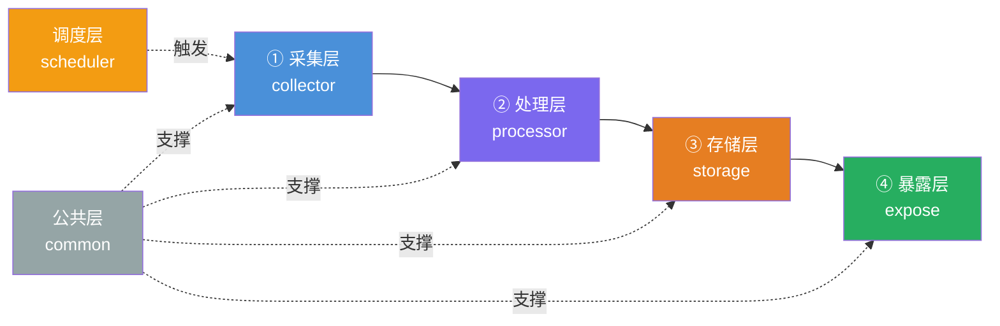

# 数据采集最佳设计方案

[TOC]

## 一、📄 概述

适配「采集 → 清洗处理 → 存储 → API 暴露」全链路，支持单机运行、多机部署、定时任务、日志完整、配置解耦、可打包上线，适配爬虫 / 传感器 / 接口拉取各类数据源。

整体遵循**分层解耦、单一职责、配置与代码分离、环境隔离**，兼容 Windows / macOS / Linux，支持 poetry / pip 两种依赖管理。

<br/>

## 二、📁 工程目录结构

```bash
data_collector/
├── .env.example                # 环境变量模板（必填，不要填真实密钥）
├── .env                        # 本地真实环境变量（git 忽略）
├── pyproject.toml              # poetry 依赖/打包配置（主推）
├── requirements.txt            # 兼容 pip 部署
├── README.md                   # 部署、启动、接口文档
├── Makefile                    # 快捷命令：启动、格式化、测试、打包
├── docker-compose.yml          # 容器一键部署（数据库+服务）
├── Dockerfile                  # 打包镜像
├── .gitignore
├── pytest.ini                  # 单元测试配置
├── logs/                       # 运行日志，自动按天切割
├── data/                       # 临时落盘文件（原始文件、缓存）
│   ├── raw/                    # 采集原始裸数据
│   ├── processed/              # 清洗后结构化数据
│   └── cache/                  # 缓存（去重、临时文件）
├── config/                     # 所有静态配置文件
│   ├── settings.py             # 全局配置入口（读取 .env + yaml）
│   ├── collector.yaml          # 采集规则：多数据源、频次、超时、代理
│   ├── storage.yaml            # 存储配置：MySQL/Redis/ES/文件路径
│   └── expose.yaml             # API 服务配置：端口、跨域、限流、鉴权
├── src/                        # 核心业务代码根目录
│   ├── __init__.py
│   ├── main.py                 # 统一入口：命令行调度入口
│   ├── collector/              # 【第一层：数据采集层】所有数据源拉取
│   │   ├── __init__.py
│   │   ├── base_collector.py   # 采集抽象基类（统一接口）
│   │   ├── api_collector.py    # HTTP 接口采集（第三方 API）
│   │   ├── spider_collector.py # 网页爬虫采集
│   │   ├── file_collector.py   # 本地/OSS 文件采集
│   │   └── device_collector.py # 硬件/传感器/串口采集
│   ├── processor/              # 【第二层：数据处理清洗】标准化加工
│   │   ├── __init__.py
│   │   ├── base_processor.py   # 处理抽象基类
│   │   ├── cleaner.py          # 去重、空值、脏数据过滤、字段校验
│   │   ├── transform.py        # 字段映射、格式转换、单位换算、编码
│   │   ├── enrich.py           # 数据补全、关联维度信息
│   │   └── validator.py        # 数据 schema 校验（pydantic）
│   ├── storage/                # 【第三层：持久化存储】统一写入层
│   │   ├── __init__.py
│   │   ├── base_storage.py
│   │   ├── mysql_store.py
│   │   ├── redis_store.py
│   │   ├── file_store.py
│   │   └── es_store.py
│   ├── expose/                 # 【第四层：对外暴露服务】API 提供数据查询
│   │   ├── __init__.py
│   │   ├── server.py           # FastAPI/Flask 主服务
│   │   ├── routes/             # 接口路由拆分
│   │   │   ├── __init__.py
│   │   │   ├── data_query.py   # 数据查询接口
│   │   │   ├── task_api.py     # 手动触发采集任务接口
│   │   │   └── health.py       # 健康检查接口
│   │   ├── middleware/         # 限流、鉴权、日志中间件
│   │   └── schemas/            # API 出入参 Pydantic 模型
│   ├── scheduler/              # 定时任务调度（定时采集）
│   │   ├── __init__.py
│   │   ├── task_manager.py     # APScheduler 统一管理定时任务
│   │   └── tasks.py            # 所有定时任务函数
│   ├── common/                 # 公共工具库（全项目通用）
│   │   ├── __init__.py
│   │   ├── logger.py           # 全局日志封装（轮转日志）
│   │   ├── http_client.py      # 统一 requests 封装（重试、代理、超时）
│   │   ├── utils.py            # 时间、MD5、路径、编码工具
│   │   └── exceptions.py       # 自定义异常（采集失败、校验失败等）
│   └── db/                     # ORM 数据库模型
│       ├── __init__.py
│       ├── models.py           # SQLAlchemy 数据表模型
│       └── session.py          # 数据库连接会话管理
├── tests/                      # 单元测试、集成测试
│   ├── test_collector/
│   ├── test_processor/
│   ├── test_storage/
│   └── test_expose_api/
└── scripts/                    # 运维辅助脚本
    ├── init_db.py              # 初始化建表
    ├── reset_cache.py
    └── crontab_task.sh         # Linux 原生定时脚本兜底
```

<br/>

## 三、🏗️ 分层架构设计

### 3.1 架构总览



### 3.2 采集层 `src/collector`

设计抽象基类强制统一方法，新增数据源不用改上层代码，遵循开闭原则。

```python
# base_collector.py
class BaseCollector:
    def fetch(self) -> list[dict]:
        """拉取原始数据"""
        raise NotImplementedError

    def close(self):
        """释放连接、关闭请求"""
        pass
```

- 多数据源拆分：接口、爬虫、文件、硬件完全隔离
- 公共 HTTP 客户端抽离到 `common/http_client`，统一配置重试、代理、UA、超时
- 采集失败自动告警（日志 + 可对接钉钉 / 企业微信）

### 3.3 处理层 `src/processor`

必须拆分三大能力，禁止清洗逻辑散落在采集代码里。

| 模块 | 职责 |
|------|------|
| `cleaner` | 删除空行、重复数据、乱码、非法值；支持按唯一键去重 |
| `transform` | 时间格式统一转 UTC、字段重命名、大小写统一、数值单位换算 |
| `validator` | 用 Pydantic 强校验字段类型，不合格数据单独写入脏数据文件，不阻塞全量任务 |
| `enrich` | 关联字典表补全地区、分类等维度 |

### 3.4 存储层 `src/storage`

统一抽象写入接口，随时切换 MySQL / Redis / 本地文件 / ES，上层业务无感知。

支持：批量插入、分表写入、写入失败重试、事务回滚。

### 3.5 暴露层 `src/expose`

优先 FastAPI（自动接口文档、类型校验、高性能），路由按业务拆分。

| 路由 | 职责 |
|------|------|
| 数据查询接口 | 按时间、ID、条件查已入库数据 |
| 任务管控接口 | 手动触发采集、终止任务、查看任务执行记录 |
| 健康接口 | 用于 k8s / 负载均衡存活探测 |

> 配套：接口限流、token 鉴权、请求日志、跨域配置。

### 3.6 调度层 `src/scheduler`

基于 APScheduler 实现分钟 / 小时 / 日定时采集。

- 多任务不同 Cron 周期
- 任务并发控制，防止重复跑
- 支持动态启停任务（通过 API 调用管控）

> 兜底方案：`scripts/crontab_task.sh` 提供 Linux crontab 脚本，适配无 Python 常驻场景。

### 3.7 公共层 `src/common`

全项目复用。

| 模块 | 职责 |
|------|------|
| `logger` | 全局唯一日志，按日期分割，控制台 + 文件双输出 |
| `exceptions` | 统一自定义异常：采集超时、接口 403、数据校验失败、数据库断开 |
| `utils` | 通用工具：时间戳转换、路径获取、MD5 去重 key 生成、文件读写 |
| `http_client` | 统一 requests 封装（重试、代理、超时） |

### 3.8 配置体系

三层配置优先级：`环境变量 .env > yaml 配置 > 代码默认值`

| 配置层 | 内容 | Git 提交 |
|------|------|---------|
| `.env` | 敏感信息：数据库账号、API 密钥、代理账号、token | ❌ 禁止提交 |
| `*.yaml` | 非敏感规则：采集地址列表、请求间隔、字段映射、cron 表达式 | ✅ 提交 |
| `settings.py` | 统一读取所有配置，全项目只导入 settings，杜绝硬编码 | ✅ 提交 |

<br/>

## 四、🚀 运行方式

### 4.1 常驻定时任务（后台持续采集）

```bash
python src/main.py scheduler
```

APScheduler 常驻，按配置自动周期跑采集。

### 4.2 单次手动采集（脚本一次性跑）

```bash
python src/main.py run-once --source=api_market
```

适合手动重跑、补数。

### 4.3 启动 API 服务（对外提供数据查询）

```bash
python src/main.py api
# 或 uvicorn 直接启动
uvicorn src.expose.server:app --host 0.0.0.0 --port 8000
```

<br/>

## 五、📋 规范约束与依赖

### 5.1 配套规范约束

1. **绝对禁止硬编码**：URL、账号、端口、超时时间全部进配置
2. **原始数据与处理数据物理隔离**：`raw` 文件夹永久留存原始数据，方便重跑修复
3. **所有入出参用 Pydantic 约束**：采集入参、处理字段、API 入参全部结构化
4. **日志分级**：INFO 正常流程、WARN 脏数据、ERROR 采集失败、CRITICAL 服务崩溃
5. **单条失败不阻断整批**：所有 IO 操作加异常捕获，单条数据失败不打断整批任务
6. **多环境隔离**：dev / test / prod 通过 `.env` 区分配置

### 5.2 依赖清单

```toml
[tool.poetry.dependencies]
python = "^3.10"
requests = "^2.31.0"          # HTTP 采集
beautifulsoup4 = "^4.12"      # 网页爬虫
pydantic = "^2.0"             # 数据校验
pyyaml = "^6.0"               # yaml 配置
python-dotenv = "^1.0"        # 读取 .env
sqlalchemy = "^2.0"           # ORM 数据库
redis = "^5.0"
fastapi = "^0.104"
uvicorn = "^0.24"
apscheduler = "^3.10"         # 定时任务
loguru = "^0.7"               # 日志
tenacity = "^8.2"             # 重试工具
pytest = "^7.4"               # 测试
```

<br/>

## 六、🔌 扩展适配方案

| 方向 | 方案 |
|------|------|
| 分布式 | 新增 `mq/` 目录接入 RabbitMQ / Kafka，采集发消息、消费处理，支持多机器横向扩容 |
| 大数据 | 处理层对接 Pandas / Polars，新增 `processor/batch` 批量大文件处理 |
| 容器化 | docker-compose 一键拉起 MySQL + Redis + 采集程序，一键部署服务器 |
| 监控 | 接入 Prometheus 埋点，统计采集条数、失败率、接口响应耗时 |

<br/>

## 七、📌 要点总结

1. **分层解耦**：采集 / 处理 / 存储 / 暴露四层独立，单一职责，开闭原则
2. **抽象基类**：各层统一抽象接口，新增数据源 / 存储介质不改上层代码
3. **配置分离**：`.env` 存敏感信息、`yaml` 存业务规则、`settings.py` 统一读取
4. **调度兜底**：APScheduler 常驻 + crontab 脚本双方案，适配常驻 / 无常驻场景
5. **单条容错**：异常捕获粒度到单条数据，失败不阻断整批任务
6. **原始留存**：`raw` 目录永久保留原始数据，支持重跑修复
7. **结构化校验**：Pydantic 贯穿采集入参 / 处理字段 / API 出入参全链路
